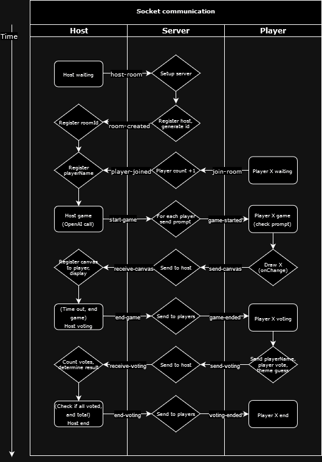

<a name="readme-top"></a>

#  Inkposter
**Inkposter** is a browser-based multiplayer party game for 3-9 players based on skribbl.io, Gartic Phone and Fake Artist goes to New York made for course DH2643 @ KTH.

<details>
  <summary>Table of Contents</summary>
  <ol>
    <li>
      <a href="#-description">Description</a>
      <ul>
        <li><a href="#demo">Demo</a></li>
      </ul>
    </li>
    <li><a href="#️-setup">Setup</a></li>
      <ul>
        <li><a href="#built-with">Built with</a></li>
        <li><a href="#getting-started">Getting started</a></li>
      </ul>
    <li><a href="#-workflows">Workflows</a></li>
      <ul>
        <li><a href="#tests">Tests</a></li>
      </ul>
    <li>
      <a href="#-architecture">Architecture</a>
      <ul>
        <li><a href="#api-endpoints">API endpoints</a></li>
        <li><a href="#socket-communication">Socket communication</a></li>
        <li><a href="#front-end">Front-end</a></li>
        <li><a href="#back-end">Back-end</a></li>
      </ul>
    </li>
    <li><a href="#the-developers">The Developers</a></li>
  </ol>
</details>

## 🔖 Description
### How to play
The game requires one host device where everything shared is displayed and 3-9 player devices where you see your personal prompts and drawings.

At the start of the game everyone receives a prompt that relates to a theme, except 1 player who is an `Inkposter`. No one knows what the theme is and no one knows who the imposter is. The `Inkposter` needs to observe the other drawings to blend in with the rest. The innocent players need to also pay attention to who might be late to draw without revealing too much information about the theme. Everyone draws on their personal devices and can see everyone else's drawings on the host device's screen.

When the timer runs out voting begins. The players vote what they suspect the theme is and who they think the `Inkposter` is. If the majority of players vote for the `Inkposter` then they're caught!

It is *recommended* to play the game using your phone and host the game on a big screen (e.g. TV, computer screen, livestream).

### Demo
The layout is designed in Figma following: https://www.figma.com/design/V4OLczauxQRw13nV0fefb7/Inkposter-Design?node-id=2407-292&node-type=frame&t=S5xK8qXW5BX97cNm-0 (Also see: [Architecture](#-architecture)).

**A demo is deployed on Heroku**: https://inkposter-917d97c7bb64.herokuapp.com.

<p align="right">(<a href="#readme-top">Back to Top</a>)</p>

## 🛠️ Setup
Prerequisites:
- You will need env variables `MongoDB_URI`, `OpenAPI_KEY`, `GITHUB_CLIENT_ID` and `GITHUB_CLIENT_SECRET` set.

### Built with
- **React** v.18.3.1
- **Node.js**
- **Express**
- **MongoDB**
- **Socket.io**
- **OAuth 2.0** on GitHub
- **TailwindCSS**
- **TypeScript**
- **Jest + React Testing Library**
- **Docker**

 <a href="https://www.flaticon.com/free-icons/ink-cartridge" title="ink cartridge icons">Favicon created by smalllikeart - Flaticon</a> and <a href="https://github.com/vinothpandian/react-sketch-canvas" title="react-sketch-canvas">react-sketch-canvas</a> package by Vinoth Pandian.

### Getting started
To start the REST API server and the client application:

**Docker-compose (recommended during development)**

The docker image for Inkposter is deployed on: https://hub.docker.com/repository/docker/ziyi01/inkposter/.

1. Build the image using `docker-compose.yml` from root:
```bash
$ docker-compose build
```
1. Run the development environment/docker container on `localhost:3000`:
```bash
$ docker-compose up -d
```

Use `docker-compose down -v` to close the container process.

**npm CLI**

1. Install npm dependencies with:
```bash
$ npm run dev-build
```
1. Start the server on `localhost:3000` with:
```bash
$ npm start
```

To run either the frontend or the backend application separately, enter the `app` or `server` folder:
1. Install npm dependencies with:
```
$ npm install
```
2. For the frontend application `app` run:
```
$ npm run build
```
3. Run the application with:
```
$ npm start
```

<p align="right">(<a href="#readme-top">Back to Top</a>)</p>

## 🧪 Workflows
| **File**        | **Workflow**                       | **Description**                       | **On**                              |
|-----------------|------------------------------------|---------------------------------------|-------------------------------------|
| `node.js.yml`   | `Node.js CI`                       | Build and run tests                   | Pull and Push to `main`-branch      |
| `test.yml`      | `Coverage`                         | Runs tests and create coverage report | Pull `main`-branch       |
| `docker.yml`    | `Docker CI`                        | Deploys the docker image              | Push to `main`-branch               |
| `main.yml`      | `Deploy`                           | Deploys the application to Heroku     | Pull request `main`-branch          |

### Tests
Test coverage is reported when creating a pull-request into the `main`-branch. The tests uses Jest for unit testing and setup using `babel.config.js` and `jest.config.js`.

Unit tests are separated into the folders `./app/__tests__` for UI tests and `./server/__test__` for server tests:

| **File**             | **Test**                                       | **Type**            |
|----------------------|------------------------------------------------|---------------------|
| `App.test.tsx`       | `Login page has login button`                  | UI test             |
| `App.test.tsx`       | `Homepage has join game button`                | UI test             |
| `App.test.tsx`       | `Profile has log out button`                   | UI test             |
| `db.test.js`         | `Create and delete user`                       | Database test       |
| `db.test.js`         | `Retrieve user stats`                          | Database test       |
| `db.test.js`         | `Update username and retrieve user`            | Database test       |
| `route.test.js`      | `/api/user/0 return test user`                 | REST API test       |
| `route.test.js`      | `/api/user/0/userStats return stats`           | REST API test       |
| `route.test.js`      | `/api/user/10000 return 404`                   | REST API test       |
| `route.test.js`      | `/api/openai/username should return 200`       | REST API test       |
| `route.test.js`      | `/api/openai/sessionPrompts should return 200` | REST API test       |

## 📄 Architecture
Architecture and file structure in the project.


### API endpoints
All API-endpoints are accessed at `https://inkposter-917d97c7bb64.herokuapp.com//api/{route}`.

| **Method**     | **URL**                            | **Description**   |
|----------------|------------------------------------|-------------------|
| `POST`         | `/user`                            | Create and persist user with unique userID |
| `GET`          | `/user/:userID`                    | Get user information {name, avatar, previous themes} |
| `GET`          | `/user/:userID/userStats`          | Get stats from user's previous games |
| `PATCH`        | `/user/:userID/username`           | Update username   |
| `PATCH`        | `/user/:userID/avatar`             | Update avatar     |
| `PATCH`        | `/user/:userID/previousTheme`      | Add current theme to users previous themes |
| `PATCH`        | `/user/:userID/sessionResults`     | Increment relevant wins/losses and add drawing to user's gallery |
| `DELETE`       | `/user/:userID/delete`             | Delete user       |
| `GET`          | `/openai/username`                 | Return a unique username generated by OpenAI |
| `GET`          | `/openai/sessionPrompts`           | Return json object with theme and prompts for both innocents and inkposter |
| `GET`          | `/github/login`                    | Login route       |

### Socket communication
Socket.io is used for real-time communication with the server and clients during the game. The clients are divided into `host` (the client whose display is used to show all drawings and triggers start of the game) and `players` (usually on a phone, where they draw and can see their role and prompt). 

Below shows the events emitted and what each role does in the communication chain (not including error handlers):



### Front-end
The front-end application uses a MVP-architecture. The code is divided into folders `components` (for repeated components and cripts), `presenters` and `views`. `userModel.tsx` is the model for the application and the app is mounted using `App.tsx` and `index.tsx`.

```
└── src/
    ├── components/
    │   ├── button.tsx
    │   ├── canvas.tsx
    │   ├── githubCallback.tsx
    │   ├── layout.tsx
    │   ├── navbar.tsx
    │   ├── playerInterface.ts
    │   ├── popup.tsx
    │   ├── route-component.tsx
    │   ├── server-requests.ts
    │   ├── socket-client.tsx
    │   └── timer.tsx
    ├── presenters/
    │   ├── homepage-presenter.tsx
    │   ├── host-end-presenter.tsx
    │   ├── host-game-presenter.tsx
    │   ├── host-voting-presenter.tsx
    │   ├── host-waiting-presenter.tsx
    │   ├── login-presenter.tsx
    │   ├── player-end-presenter.tsx
    │   ├── player-game-presenter.tsx
    │   ├── player-voting-presenter.tsx
    │   ├── player-waiting-presenter.tsx
    │   └── profile-presenter.tsx
    ├── views/
    │   ├── homepage.tsx
    │   ├── host-game.tsx
    │   ├── host-session-end.tsx
    │   ├── host-voting.tsx
    │   ├── host-waiting.tsx
    │   ├── loading.tsx
    │   ├── login-page.tsx
    │   ├── mock-login.tsx
    │   ├── player-game.tsx
    │   ├── player-session-end.tsx
    │   ├── player-voting.tsx
    │   ├── player-waiting.tsx
    │   └── profile.tsx
    ├── App.css
    ├── App.tsx
    ├── global.css
    ├── index.css
    ├── index.tsx
    └── userModel.tsx
```

### Back-end
The back-end is quite short, `routes/api.js` contain the REST endpoints of the app. `bin/www` initialises the server and socket.io. `db.js`, `openai.js` and `socket.js` implement MongoDB, OpenAI and socket.io respectively.

```
└── server/
    ├── bin/
    │   └── www
    ├── routes/
    │   └── api.js
    ├── app.js
    ├── db.js
    ├── openai.js
    └── socket.js
```

## The Team
- <a href="https://github.com/gorwat">Jessica Gorwat</a>
- <a href="https://github.com/JuliaHallberg">Julia Hallberg</a>
- <a href="https://github.com/okam97">Oliver Kamruzzaman</a>
- <a href="https://github.com/ziyi01/">Julia Wang</a>

<p align="right">(<a href="#readme-top">Back to Top</a>)</p>
